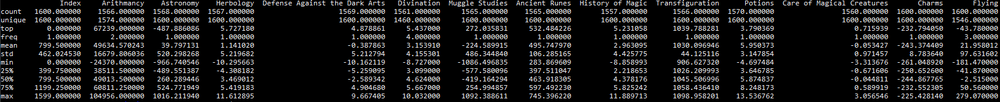

# DSLR [(subject)](https://cdn.intra.42.fr/pdf/pdf/5914/DatascienceLogisticRegression.en.pdf)

## Introduction

On no! Since its creation, the famous school of wizards, Hogwarts, had never known such an offense. The forces of evil have bewitched the Sorting Hat. It no longer responds, and is unable to fulfill his role of sorting the students to the houses.

The new academic year is approaching. Gladly, the Professor McGonagall was able to take action in such a stressful situation, since it is impossible for Hogwarts not to welcome new students. . . She decided to call on you, a muggle "datascientist" who is able to create miracles with the tool which all muggles know how to use: a "computer".
Despite the intrinsic reluctance of many wizards, the director of the school welcomes you to his office to explain the situation. You are here because his informant discovered that you are able to recreate a magic Sorting Hat using your muggle tools. You explain to him that in order for your "muggle" tools to work, you need students data. Hesitantly, Professor McGonagall gives you a dusty spellbook. Fortunately for you, a simple "Digitalis!" and the book turned into a USB stick.

## Objective

In this project DataScience x Logistic Regression, you will continue your exploration of Machine Learning by discovering different tools.

The use of the term DataScience in the title will be clearly considered by some to be abusive. That is true. We do not pretend to give you all the basics of DataScience in this topic. The subject is vast. We will only see here some bases which seemed to us useful for data exploration before sending it to the machine learning algorithm.

You will implement a linear classification model, as a continuation of the subject linear regression : a logistic regression. We also encourage you a lot to create a machine learning toolkit while you will move along the branch.

Summarizing :

• You will learn how to read a data set, to visualize it in different ways, to select and
clean unnecessary information from your data.

• You will train a logistic regression that will solve classification problem.

## Formulas

### Install
<pre>
<code>git clone </code>
<code>python -m pip install -r lib.txt</code></pre> 

### Usage

#### Describe
To describe dataset
<pre><code>python describe.py "./resources/dataset_train.csv"</code>
This will display a describe of dataset, like pandas
</pre>

#### Histrogam
To display a histogram answering:

Which Hogwarts course has a homogeneous score distribution between all four houses ?
<pre><code>python histogram.py "./resources/dataset_train.csv"</code>
This will open a new window with a histogram
</pre>

#### Scatter Plot

To display a scatter plot answering:

What are the two features that are similar ?
<pre><code>python scatter_plot.py "./resources/dataset_train.csv"</code>
This will open a new window with a scatter plot 
</pre>

#### Pair Plot
To display a pair plot or scatter plot matrix answering:

From this visualization, what features are you going to use for your logistic regression?
<pre><code>python pair_plot.py "./resources/dataset_train.csv"</code>
This will open a new window with a pair plot with "seaborn"
</pre>

#### Train
To train our model
<pre><code>python logreg_train.py -h</code>
usage: logreg_train.py [-h] [-v] [-vi House N_feature1 N_feature2] dataset

train our model with a dataset

positional arguments:
  dataset: dataset, needs to be a csv

optional arguments:
  -h, --help: show this help message and exit
  -v, --verbose: display in real time actions of training
  -vi House N_feature1 N_feature2: display data of one house in a separate windows

<code>python logreg_train.py "./resources/dataset_train.csv" -vi "Ravenclaw" 1 2</code>
This will train our model with the dataset, and with -vi option, display graph about this training in "one vs all" format"
</pre>

</pre>

#### Predict
To predict a house with our model
<pre><code>python logreg_predict.py -h</code>
usage: logreg_predict.py [-h] [-a] [-p] dataset weights

predicts student's house with our model

positional arguments:
  dataset: dataset, needs to be a csv
  weights: weights, needs to be a csv

optional arguments:
  -h, --help: show this help message and exit
  -a, --accuracy: show accuracy for dataset_train
  -p, --piechart: print a piechart for the results

<code>python logreg_predict.py "./resources/dataset_test.csv" "./weights.csv" -p</code>
This will predict a house for each student in the test dataset, and with -p option, display a pie chart
</pre>

</pre>